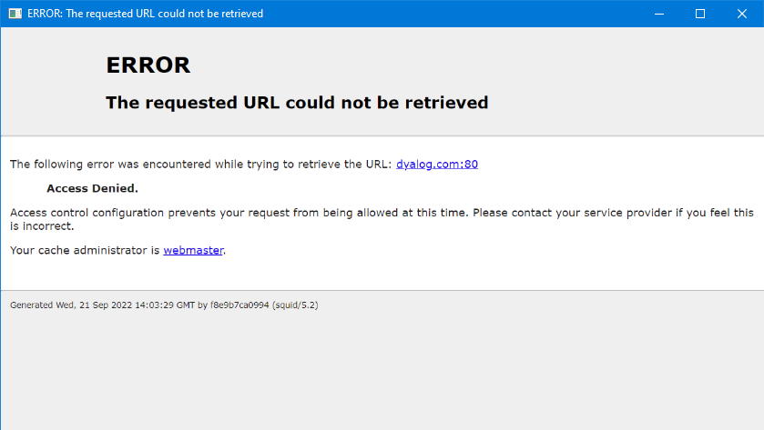

A proxy server is a server that acts as an intermediary between `HttpCommand` (which makes requests for resources) and the host server that provides those resources. Proxy servers can be used for a number of purposes including load balancing, privacy, and security.

To use a proxy server with `HttpCommand`:

* Set `URL` to the address of the host server. Be sure to include the proper scheme (either `http://` or `https://`).  
* Set any other settings, for example `Headers`, `Params`, `Auth`/`AuthType`, etc., required for the host server.
* Set `ProxyURL` to the address of the proxy server.
* If the proxy server requires headers of its own, specify them in `ProxyHeaders`.
* If the proxy server itself requires authentication to connect to the host server, specify `ProxyAuth` and `ProxyAuthType` as appropriate.

See [Proxy-related Settings](./proxy-settings.md) for more information on proxy settings.

### Examples
The examples here were developed using a [Squid proxy server](http://www.squid-cache.org/) running in a Docker container on a machine in the author's home network. Squid is a popular proxy server available as free software released under the GNU General Public License.

This particular Squid server is configured to serve only HTTPS requests, such that even though the connection to the proxy server is initialized using HTTP, the connection to the host server is "upgraded" to use HTTPS. `HttpCommand` takes care of upgrading the connection. 

First, create a new instance of `HttpCommand` and, in this case, specify the `Command` as `'get'` and the `URL` as `'dyalog.com'`. Note that we did not specify a scheme in `URL`.

```      
      h←HttpCommand.New 'get' 'dyalog.com'
```
Now specify the URL for the proxy server. In this case, it's the IP address of the machine on the author's network and the default Squid port of 3128. Then run the request.
```
      h.ProxyURL←'192.168.1.123:3128' ⍝ set the proxy server address
      ⊢r←h.Run
[rc: 0 | msg: Proxy CONNECT response failed | HTTP Status: 403 "Forbidden" | ⍴Data: 3372]
```
The request failed when the proxy server tried to connect to dyalog.com.  Notice that there is some `Data` in the response; it turns out that Squid returns some HTML when something fails.  We can examine it using HTMLRenderer.
```
      'hr' ⎕WC 'HTMLRenderer' ('HTML' r.Data)
```

What went wrong? We didn't specify the scheme for dyalog.com. Let's try again...
```
      h.URL←'https://dyalog.com'
      h.Run
[rc: 0 | msg:  | HTTP Status: 200 "OK" | ⍴Data: 23043]
```
With the proper scheme specified, the request succeeds.